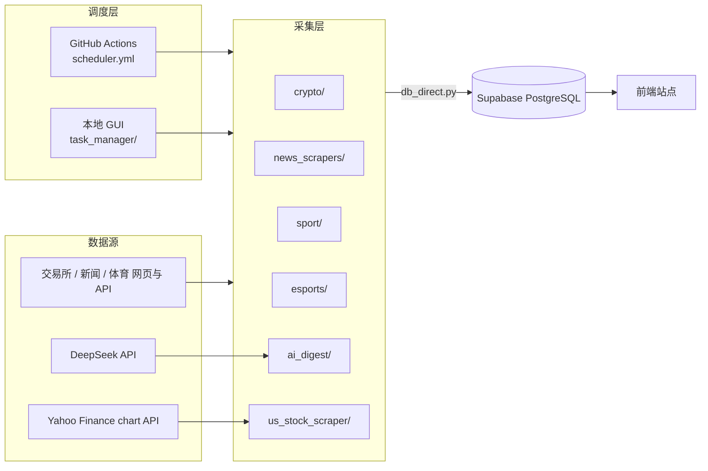

# Crypto Collector

加密货币、体育赛事、新闻资讯、电竞与美股行情多源数据采集与发布系统。爬虫抓取数据后**直连 PostgreSQL 写入 Supabase**，前端站点消费展示；定时调度支持 **GitHub Actions** 与**本地 GUI 面板**两条通道。

## 架构总览



- **采集层**：按业务域分包的独立 Python 脚本，每个脚本可单独运行。
- **数据层**：`db_direct.py` 直连 PostgreSQL，绕过 Supabase REST API 的作业限制。
- **调度层**：GitHub Actions 定时执行 + `task_manager/` 本地 tkinter 面板手动管理。
- **详细说明见** [`docs/`](docs/README.md)。

## 目录结构

```
crypto-collector/
├── crypto/                    # 加密市场
│   ├── price_collector.py     #   CoinCap 价格采集 → tokens 表
│   ├── airdrop_scraper.py     #   交易所空投/福利公告 → 帖子
│   ├── tokocrypto/            #   Tokocrypto 活动（httpx）
│   ├── indodax/               #   Indodax 博客（WP REST API）
│   ├── pintu/                 #   Pintu 博客（WP REST API）
│   ├── mobee/                 #   Mobee 新闻（Webflow HTML）
│   ├── osl/                   #   OSL 公告（Playwright）
│   ├── bitget/                #   Bitget 新闻（Playwright）
│   └── okx/                   #   OKX 公告（Playwright）
├── news_scrapers/             # 新闻/体育资讯
│   ├── binance/               #   币安广场新闻（Playwright）
│   ├── indo_news/             #   印尼热点（Google News RSS + trends24）
│   ├── sport_detik/           #   Detik Sport（RSS）
│   ├── tribunbola/            #   Tribunbola
│   ├── bolasport/             #   BolaSport（Playwright）
│   ├── dailysports/           #   Dailysports
│   ├── mainbasket/            #   Mainbasket（IBL 篮球）
│   └── ibl_data/              #   IBL Gopay 2026 赛事数据
├── sport/                     # 足球/羽毛球赛事
│   ├── schedule/              #   FIFA 2026 赛程
│   ├── blog/                  #   FIFA 官方 Blog
│   ├── goal/                  #   世界杯比分
│   ├── forebet/  fastscore/  footballant/   # 印尼联赛数据（CloakBrowser）
│   └── badminton/             #   BWF 印尼赛 + 全年赛历（CloakBrowser）
├── esports/                   # 电竞新闻（DuniaGames）
├── ai_digest/                 # DeepSeek AI 日报 + 机器人观点发帖
├── us_stock_scraper/          # 美股 1 分钟 K 线 + 趋势汇总
├── tg_summary_bot/            # 独立子系统：Telegram 群消息汇总（Telethon + SQLite）
├── task_manager/              # 本地 GUI 任务面板（APScheduler）
│   ├── gui.py                 #   tkinter 界面
│   ├── scheduler_engine.py    #   调度引擎 + YAML 导入/同步
│   ├── create_bots.py         #   批量创建机器人账号
│   └── _cleanup_indo_news.py  #   一次性清理脚本
├── tools/                     # 运维脚本（诊断/清理/VACUUM）
├── docs/                      # 项目文档（见下）
├── db_direct.py               # Supabase 直连 PostgreSQL 工具
├── run_task_manager.py        # 本地任务面板入口
├── requirements.txt           # Python 依赖
├── .env.example               # 环境变量模板
└── .github/workflows/scheduler.yml   # GitHub Actions 定时调度
```

## 快速开始

### 环境要求

- Python 3.11+
- Windows / Linux / macOS

### 安装

```bash
pip install -r requirements.txt

# 需要浏览器自动化的爬虫（binance / osl / bitget / okx / fifa / esports / goal）
playwright install chromium
```

> CloakBrowser 为反检测备选（`us_stock_scraper`、`sport/*` 部分脚本使用），按 `cloakbrowser` 文档安装。
> 选择 Playwright 还是 CloakBrowser 的规则见 [`docs/conventions.md`](docs/conventions.md)。

### 配置

复制 `.env.example` 为 `.env` 并填入真实值：

```bash
cp .env.example .env
```

核心变量（完整清单见 [`docs/operations.md`](docs/operations.md)）：

| 变量 | 说明 |
|---|---|
| `DATABASE_URL` | Supabase PostgreSQL 直连串（首选） |
| `SUPABASE_URL` + `SUPABASE_DB_PASSWORD` | 直连的备选方式（二选一） |
| `SUPABASE_SERVICE_ROLE_KEY` | 仅在 `create_bots.py` 等少数脚本使用 |
| `COINCAP_API_KEY` | CoinCap 价格采集 |
| `DEEPSEEK_API_KEY` | AI 日报 / 机器人观点 |
| `POSTS_AUTHOR_USERNAME` | 默认发帖账号（`indoAdmin`） |
| `*_CATEGORY_NAME` | 各业务域发帖分类 |

### 运行方式

**方式一：本地任务面板（推荐交互调试）**

```bash
python run_task_manager.py
```

面板可：启停任务、编辑 cron、立即执行、按分类批量执行、查看实时日志、同步配置回 YAML。详见 [`docs/scheduling.md`](docs/scheduling.md)。

**方式二：GitHub Actions**

推送到 `main` 分支后按 `scheduler.yml` 中的 cron 调度；也可在 Actions 页面 `workflow_dispatch` 手动触发。需在仓库 Settings 配置 Secrets / Variables。

**方式三：单脚本命令行**

```bash
# 加密价格（无 --save，直接写 tokens 表）
python crypto/price_collector.py

# 空投福利（不加 --save 只预览）
python crypto/airdrop_scraper.py --save --max 20

# 币安新闻
python news_scrapers/binance/news_scraper.py --scroll 5 --max 50 --save

# AI 日报
python ai_digest/ai_digest.py --save --max 10

# 美股 1 分钟 K 线并上传
python us_stock_scraper/us_stock_scraper.py --upload --backfill 4
```

> 全部爬虫的入口命令、数据源与频率见 [`docs/scrapers.md`](docs/scrapers.md)。

## 发布模型

所有发帖类爬虫写入 Supabase `posts` 表：

- **字段**：`title` / `content`(HTML) / `author_id` / `category_id` / `post_type="info"` / `status="pending_review"` / 时间戳。
- **作者**：从 `profiles` 按用户名或随机机器人账号解析。
- **分类**：从 `categories` 按 `*_CATEGORY_NAME` 环境变量解析，未配置时用脚本默认值。
- **标签**：写入 `tags` + `post_tags`，多数脚本按标题/正文关键词自动打标。
- **幂等**：多数脚本先按 `title` 查重，存在则跳过/更新，避免重复发帖。

数据表细节见 [`docs/data-model.md`](docs/data-model.md)。

## 爬虫一览（摘要）

| 域 | 入口 | 数据源 | 抓取方式 | 分类变量 |
|---|---|---|---|---|
| 加密价格 | `crypto/price_collector.py` | CoinCap v3 | httpx | —（写 tokens） |
| 空投福利 | `crypto/airdrop_scraper.py` | Binance/Bybit/OKX/Gate | httpx | `HOT_TOKENS_CATEGORY_NAME` |
| 印尼交易所 | `crypto/{tokocrypto,indodax,pintu,mobee,osl,bitget,okx}/` | 各交易所官网 | httpx / Playwright | 各自 `*_CATEGORY_NAME` |
| 币安新闻 | `news_scrapers/binance/news_scraper.py` | 币安广场 | Playwright | `POSTS_CATEGORY_NAME` |
| 印尼热点 | `news_scrapers/indo_news/indo_news_scraper.py` | Google News RSS + X 热搜 | httpx | `INDO_CATEGORY_NAME` |
| 体育资讯 | `news_scrapers/{sport_detik,tribunbola,bolasport,dailysports,mainbasket,ibl_data}/` | 各体育媒体 / FIBA LiveStats | httpx / Playwright | `FIFA_CATEGORY_NAME` |
| 世界杯 | `sport/schedule`, `sport/blog`, `sport/goal` | FIFA / Goal.com | Playwright + httpx | `FIFA_CATEGORY_NAME` |
| 印尼联赛 | `sport/{forebet,fastscore,footballant}/` | 各数据站 | CloakBrowser | `FIFA_CATEGORY_NAME` |
| 羽毛球 | `sport/badminton/` | BWF / olympics.com | CloakBrowser | `FIFA_CATEGORY_NAME` |
| 电竞 | `esports/esports_scraper.py` | DuniaGames | Playwright + httpx | `ESPORTS_CATEGORY_NAME` |
| AI 日报 | `ai_digest/ai_digest.py` `bot_posts.py` | DeepSeek | httpx | `HOT_TOKENS_CATEGORY_NAME` |
| 美股 | `us_stock_scraper/us_stock_scraper.py` | Yahoo Finance | CloakBrowser | —（写 us_stock_*） |
| TG 汇总 | `tg_summary_bot/main.py` | Telegram 群 | Telethon | —（独立 SQLite） |

## 文档

| 文档 | 内容 |
|---|---|
| [docs/README.md](docs/README.md) | 文档索引与维护约定 |
| [docs/architecture.md](docs/architecture.md) | 系统架构、模块分层、公共模式 |
| [docs/data-model.md](docs/data-model.md) | Supabase 数据表与去重/upsert 语义 |
| [docs/scheduling.md](docs/scheduling.md) | GitHub Actions + 本地 GUI 双调度通道 |
| [docs/scrapers.md](docs/scrapers.md) | 全部爬虫的入口/数据源/参数清单 |
| [docs/operations.md](docs/operations.md) | 环境变量、运维脚本、故障排查 |
| [docs/conventions.md](docs/conventions.md) | 编码规范与新增爬虫步骤 |

## 已知问题

- GitHub Actions 的 `on.schedule` 目前有 23 条相同的 `0 0 * * *` 条目，而 27 个 job 都没有 `if` 条件；每次触发会执行工作流内全部 job。存在重复执行风险，详见 [docs/scheduling.md](docs/scheduling.md) 的"已知问题"。
- `.env.example` 早期版本曾包含真实密钥，需轮换对应凭据（见 [docs/operations.md](docs/operations.md)）。
- `news_scrapers/binance/assemble_posts.py` 已废弃，改用 `news_scraper.py --save`。

## 许可证

MIT
