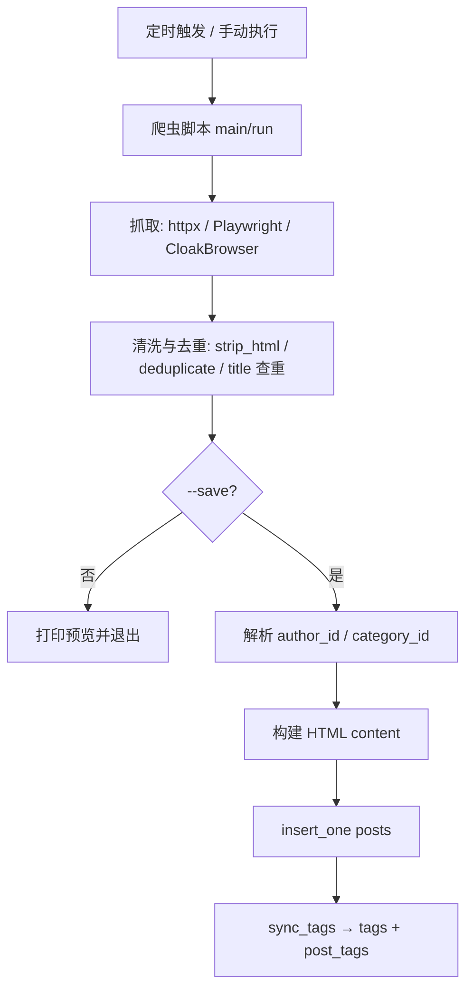

# 系统架构

## 1. 设计目标

1. **多源独立采集**：每个数据源一个脚本，互不依赖，单点失败不影响其他采集。
2. **调度与采集解耦**：脚本既能被 GitHub Actions 批量调度，也能在本地面板单独/批量执行。
3. **写库幂等**：以标题/业务键去重，重复运行不产生重复帖子。
4. **规避平台限制**：绕过 Supabase REST API 的作业限制，直连 PostgreSQL。

## 2. 分层结构

```
┌────────────────────────────────────────────────────────────┐
│ 调度层                                                       │
│  .github/workflows/scheduler.yml   （云端定时，UTC）          │
│  task_manager/                     （本地 tkinter + APScheduler）│
└───────────────┬────────────────────────────────────────────┘
                │ 以子进程执行 python <脚本> --save ...
┌───────────────▼────────────────────────────────────────────┐
│ 采集层（按业务域分包）                                        │
│  crypto/  news_scrapers/  sport/  esports/                   │
│  ai_digest/  us_stock_scraper/                               │
│  tg_summary_bot/  （独立子系统：Telethon + SQLite）           │
└───────────────┬────────────────────────────────────────────┘
                │ from db_direct import ...
┌───────────────▼────────────────────────────────────────────┐
│ 数据层                                                       │
│  db_direct.py  →  psycopg2 直连 Supabase PostgreSQL          │
└───────────────┬────────────────────────────────────────────┘
                │
           Supabase（前端站点消费）
```

### 各层职责

| 层 | 位置 | 职责 |
|---|---|---|
| 调度层 | `.github/workflows/scheduler.yml`、`task_manager/` | 定时/手动触发采集脚本，管理 cron 配置 |
| 采集层 | `crypto/`、`news_scrapers/`、`sport/`、`esports/`、`ai_digest/`、`us_stock_scraper/` | 抓取、清洗、生成 HTML、写库 |
| 数据层 | `db_direct.py` | 提供连接与 CRUD；解析连接串；upsert/批量写入 |
| 运维层 | `tools/`、`task_manager/_cleanup_indo_news.py` | 诊断、清理、VACUUM 等一次性/运维操作 |
| 独立子系统 | `tg_summary_bot/` | Telegram 群消息采集与统计，使用本地 SQLite，与 Supabase 无关 |

## 3. 数据流



## 4. 公共代码模式

采集脚本高度模板化，新增脚本应复用以下模式（见 [`conventions.md`](conventions.md)）：

| 模式 | 说明 |
|---|---|
| `sys.path.insert(0, str(Path(__file__).parent.parent))` | 让子目录脚本能 `import db_direct`（层级按目录深度调整） |
| `load_dotenv(dotenv_path=<项目根>/.env)` | 加载根目录 `.env` |
| `get_author_id()` / `get_category_id()` | 从 `profiles` / `categories` 按用户名/分类名解析 ID，失败 `sys.exit(1)` |
| `get_random_bot()` | 从 `profiles` 随机取一个机器人账号作为发帖人 |
| `sync_tags(post_id, tags)` | 按名查/建 `tags`，再写 `post_tags` 关联（去重） |
| `build_post_html(item)` | 生成印尼风格的 HTML 帖子正文 |
| `_e(text)` / `strip_html(text)` | HTML 转义 / 去标签 |
| `deduplicate(items)` | 按标题小写前缀去重 |
| `argparse`：`--save`、`--max`（部分含 `--scroll`、`--live`、`--output`） | `--save` 控制是否写库，默认仅预览 |
| `logging.basicConfig(...)` | 统一日志格式，便于调度器流式捕获 |

## 5. 关键设计决策

### 5.1 为什么直连 PostgreSQL

Supabase Free Plan 对 REST API 有作业限制，批量写入易失败。`db_direct.py` 用 `psycopg2` 直连数据库，支持事务、`ON CONFLICT` upsert、`VACUUM` 等操作。连接配置优先级：`DATABASE_URL` > `SUPABASE_URL` + `SUPABASE_DB_PASSWORD`。

### 5.2 抓取工具选择

需要浏览器时优先 Playwright；遇到超时/403/反爬再降级 CloakBrowser（两者 API 兼容，仅 import 与启动方式不同）。详见 [`conventions.md`](conventions.md)。

### 5.3 发帖幂等

- 新闻类：按 `title` 查重，存在则跳过。
- 比分/赛事类（`goal`、`fastscore`、`bwf_*` 等）：按标题找到已有帖子后 `UPDATE` 内容，实现"同一场比赛一条帖子、内容持续刷新"。
- 价格/行情类：按业务键 upsert（`tokens.coincap_id`、`us_stock_bars(symbol,bar_time)`）。

### 5.4 独立子系统

`tg_summary_bot/` 有自己的 `.env`、`requirements.txt` 与 SQLite 数据库，不参与 GitHub Actions 调度，独立运行。

## 6. 目录职责速查

| 目录 | 职责 |
|---|---|
| `crypto/price_collector.py` | CoinCap 价格 → `tokens` |
| `crypto/airdrop_scraper.py` | 交易所空投/福利公告 → 帖子 |
| `crypto/{tokocrypto,indodax,pintu,mobee,osl,bitget,okx}/` | 印尼交易所新闻/公告 → 帖子 |
| `news_scrapers/binance/` | 币安广场新闻 → 帖子 |
| `news_scrapers/indo_news/` | 印尼热点 → 帖子 |
| `news_scrapers/{sport_detik,tribunbola,bolasport,dailysports,mainbasket,ibl_data}/` | 体育资讯/赛事数据 → 帖子 |
| `sport/schedule/`、`sport/blog/` | FIFA 赛程、官方 Blog |
| `sport/goal/` | 世界杯比分 |
| `sport/{forebet,fastscore,footballant,badminton}/` | 印尼联赛/羽毛球数据 |
| `esports/` | 电竞新闻 |
| `ai_digest/` | AI 日报与机器人观点 |
| `us_stock_scraper/` | 美股 K 线与趋势 |
| `task_manager/` | 本地调度面板 |
| `tools/` | 运维脚本 |
